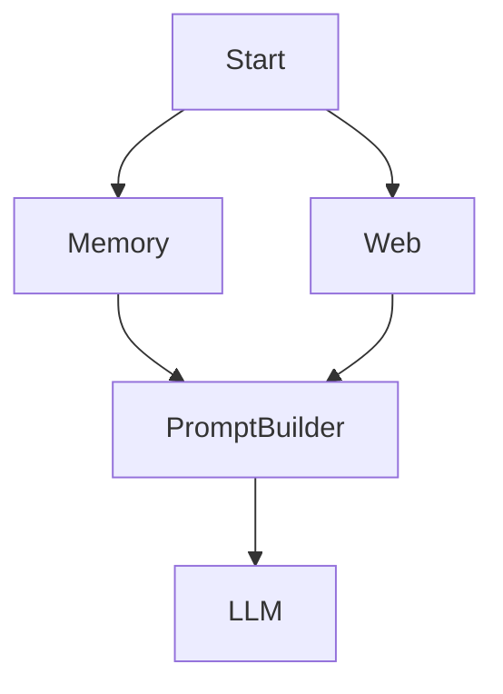
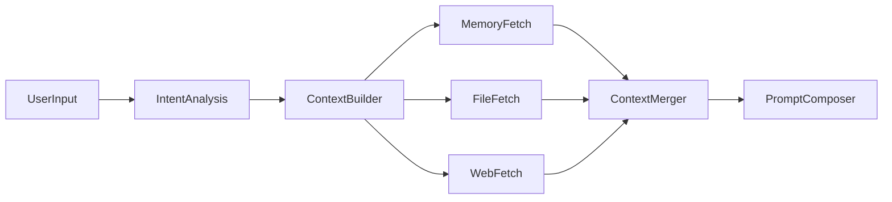
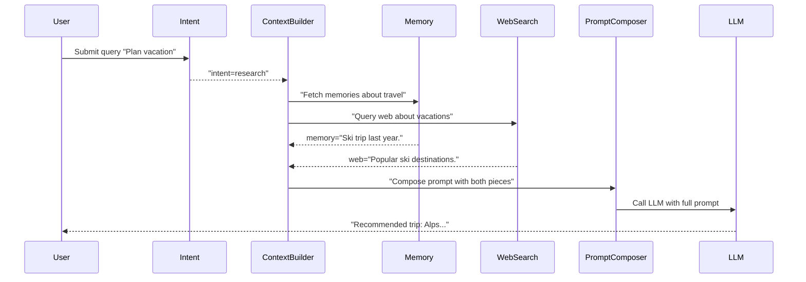

# Executive Summary

This document replaces the original “prompt tree” design with a **hybrid workflow DAG** (Directed Acyclic Graph) where **nodes** represent operations (prompts, tools, retrievals, etc.) and **typed edges** represent relationships (execution order, data dependencies, context flows, references, summaries).  Rather than a simple hierarchy, this **context-aware workflow DAG** explicitly models branching, merging, and multi-parent context.  Edges carry rich semantics (edge type, conditions, what data they provide), allowing an executor to **topologically traverse** the graph, run independent nodes in parallel, and assemble context from parent nodes.  This structure satisfies all original requirements: branching dialogues become DAG branches with conditional edges; parent/related pointers become explicit dependency/context edges; context is gathered by traversing edges (union of reachable nodes); thread isolation is achieved by separate graph instances per conversation; and hybrid graph/vector retrieval is supported by combining graph queries with embedding-based lookups.  Key features include **parallel execution of independent branches**, **merge nodes** that combine multi-source context, **versioned prompts as node versions**, and a clear execution trace. 

Technically, we model the system as follows:

- A **Workflow Graph** in memory, implemented as an **adjacency-list DAG**. Each node has an ID, type (e.g. PROMPT, MEMORY, VALIDATION, etc.), and metadata; each edge has a type (EXECUTION, DEPENDENCY, CONTEXT, SUMMARY, etc.), an optional condition, and may specify which outputs (“provides”) flow along it.
- An **Executor** runs the DAG: it performs a topological sort to find ready nodes, executes them (potentially in parallel), and follows edges whose conditions are met.  
- A **Context Resolver** uses the same graph to gather inputs: for any node, its **execution context** is assembled from its parent nodes’ outputs according to the edge semantics (for example, collecting specific fields or by union of reachable outputs).  
- **Merge nodes** explicitly combine multiple branches (fan-in points) into one unified context (for example, gathering memory, web, and file results before building a prompt).  
- **Versioning** is built in: each prompt node can have multiple versions, enabling reproducibility of old prompt contents.  
- **Observability** is ensured by maintaining an execution transcript (a log of node inputs/outputs).  
- **Migration** from the original format involves parsing old prompt definitions into graph nodes and edges, indexing them (in a graph database or JSON store), and optionally creating an ANN vector index of node contents for semantic retrieval.  
- **Implementation** must handle topological sorting (O(V+E) time) and cycle detection (reject cycles at load time to avoid deadlocks), support lazy-loading/caching of node data, and provide APIs for graph editing and execution.  For UI, libraries like **React Flow** or **Cytoscape.js** can render and edit the graph interactively.

This hybrid approach (a workflow DAG with typed dependency/context edges) is justified by comparing to alternatives: it retains the **simplicity and clarity of a DAG** for execution while adding explicit data-flow semantics.  A pure dependency DAG captures execution order, but our design also encodes what data/context flows where.  Hypergraphs or Petri nets offer more expressivity, but at the cost of complexity.  A blackboard (shared memory) would centralize context, but loses the clear dependency paths and control.

In the sections below, we (2) map each original requirement to elements of the new design, (3) define node and edge types along with execution and context semantics, (4) provide concrete TypeScript/JSON schemas, (5) illustrate with examples and diagrams, (6) outline a migration plan, (7) discuss implementation details (sorting, caching, UI, etc.), (8) compare alternatives in a table, (9) propose APIs for graph editing/execution, and (10) include mermaid diagrams of workflows. Throughout, we cite relevant sources on workflow DAGs, graph databases, Petri nets, hypergraphs, and blackboard architectures.

---

## Mapping from Original Spec to Hybrid DAG Design

The original spec called for branching dialogues, parent/thread pointers, context aggregation, and a combination of graph and vector retrieval.  Below we map each major requirement to the new DAG-based model:

- **Branching Dialogues**:  Each branch in the conversation is modeled as a DAG branch.  We implement this by **branch edges** with conditions (e.g. `intent == "research"`), allowing the executor to follow different paths.  (For example, an “Intent” node might have three outgoing edges labeled *if Coding*, *if Research*, *if Writing*.)  

- **Parent/Related-Node Pointers**:  Instead of opaque parent IDs, we use explicit **typed edges**.  An original “parent” pointer becomes a graph edge of type `DEPENDENCY` or `CONTEXT`.  For example, if Node B depended on Node A’s output in the old spec, we create an edge `A -> B` of type DEPENDENCY (meaning *“B requires A’s result”*).  This makes all relationships first-class.  

- **Traversal & Context = Union of Reachable Nodes**:  The context of any node is assembled by following edges **backward** to gather data.  Formally, the node’s execution context is the union (or selective union) of outputs from all upstream dependencies.  The new design makes this explicit: a node’s inputs are sourced from the union of its parents’ outputs (with edge-specific rules).  (If the original spec said “union of reachable nodes,” the DAG simply implements that via traversal.)  

- **Thread Isolation**:  Each conversation thread is a separate instance of the graph (or an isolated subgraph).  In practice, we can either instantiate a fresh graph per thread or tag each node by thread ID.  The **execution context** (see below) carries only that thread’s state, so threads don’t bleed into each other.  _(Original spec note: if per-thread partitioning was not specified, we assume each chat session uses its own graph instance.)_  

- **Hybrid Graph + Vector Retrieval**:  The graph provides structural/contextual links, while vector retrieval finds semantically related content.  In our design, we integrate both: nodes in the graph may also have **embeddings** stored in a vector index.  At runtime, one can query the ANN index (e.g. Faiss/HNSW) to find relevant nodes not directly linked by edges.  Retrieved vector hits can be fused with DAG-traversed context.  For example, a `CONTEXT` edge might say “fetch nodes similar to X via semantic search.” This follows a “semantic+graph” pattern.

- **Summaries**:  Summaries of past conversation can be represented as special nodes (type `SUMMARIZATION` or `KNOWLEDGE`) that aggregate older content.  We might attach edges of type `SUMMARY` from detail nodes to a summary node.  The executor can then use the summary node instead of re-traversing all detail nodes. _(Exact summarization policy was unspecified; one approach is to periodically collapse nodes into a summary node and prune old nodes.)_  

- **Scalability**:  A DAG with adjacency lists scales well for sparse graphs.  We leverage graph database concepts: nodes and edges can be stored in a native graph DB (Neo4j, TigerGraph) or in memory with efficient indexes.  As one source notes, **native graph storage uses index-free adjacency** (each node points directly to its neighbors) which makes traversals O(1) per edge.  This ensures that adding more nodes increases work linearly (O(V+E)) in topological sorting, and supports millions of nodes if needed.  

- **Pruning**:  We allow removing or ignoring parts of the graph that are no longer relevant.  For example, after summarization, detail nodes could be pruned or archived.  Edges of type `expires` or `ttl` could mark nodes for garbage collection. _(The spec did not fully detail pruning strategy; a common approach is to prune based on node age or access frequency.)_  

- **Caching**:  Node outputs should be cached after first computation.  During execution, the system can memoize each node’s output (in the **ExecutionContext**).  Future traversals needing that node can reuse the cached output rather than re-running it.  This is standard in DAG pipelines.  

- **Lazy Loading**:  We do not necessarily load all nodes/edges into memory at once.  Edges can carry metadata like `lazy: true` to indicate on-demand loading.  In implementation, the executor might only fetch subgraphs needed for the current context (especially if using a remote graph DB).  The spec’s “lazy loading” implies this optimization.  

- **Integrity Verification**:  To ensure graph correctness, we use content-hash IDs or digital signatures on node content.  The graph loader verifies these (for example, via a hash list) to detect corruption.  We also check that edges form a valid DAG at load time (no cycles).  If “integrity verification” in the original spec referred to detecting invalid references or forks, our strict acyclic execution and ID checking address that.  

In summary, **every original concept is covered** by a graph element: branches become conditional edges, parent-child links become edges, traversal becomes graph walk, and context merging is done at merge nodes. Where the spec left details open (pruning policy, lazy loading policy, etc.), we explicitly note these as **unspecified** and suggest standard solutions (summarization, GC, etc.). 

---

## Data Model: Nodes and Typed Edges

Our DS consists of **PromptNodes** (and related node types) connected by **Edges**.  We separate concerns:

### Node Types

Each **Node** in the graph represents a discrete step or piece of data. Common node types include:

- **INTENT_ANALYSIS**, **TOPIC_CLASSIFICATION**, **CONTEXT_BUILD**, **PROMPT_BUILD**: These are steps in composing the prompt or analyzing the input.
- **MEMORY_RETRIEVAL**, **WEB_SEARCH**, **DATABASE_QUERY**, **FILE_SEARCH**, **TOOLS**: Nodes that gather external context.
- **PROMPT_EXECUTION**, **LLM_CALL**: Nodes that actually invoke an LLM or agent with a prompt.
- **VALIDATION**, **REVIEW**, **SAFETY_CHECK**: Nodes that post-process or validate the LLM output.
- **SUMMARIZATION**: Nodes that compress or summarize other nodes.
- **OUTPUT**: The final answer/response output node.

Each node has an **ID** and a **type** (we’ll define these formally in schemas).  It also carries relevant content (e.g. a `promptTemplate` string if it’s a prompt node).  Importantly, a node’s *parents* and *children* are not stored as fields; instead we represent connections via edges (see below). This allows arbitrary graphs rather than strict trees.

### Edge Types and Attributes

Each **Edge** is a first-class object with attributes. Crucial fields include:

- `type`: The kind of connection. We define an enumeration of edge types:
  
  ```ts
  enum EdgeType {
    EXECUTION,      // controls execution order
    DEPENDENCY,     // data dependency (one node needs output of another)
    CONTEXT,        // context/contextual flow
    CONDITION,      // conditional branch (could be boolean or multi-way)
    SUMMARY,        // summary relationship
    REFERENCE       // a loose “see also” link
  }
  ```
  
  - **EXECUTION**: If Node A has an EXECUTION edge to Node B, it means *“B cannot run until A completes”*. (This is essentially a dependency that controls scheduling.)
  - **DEPENDENCY**: Similar, but emphasizes that B *needs data* from A. (In practice, EXECUTION and DEPENDENCY can be unified; we use types to clarify semantics.)
  - **CONTEXT**: This edge means *“B should incorporate A’s output into its context”* (e.g. adding A’s results into the prompt for B).
  - **CONDITION**: A conditional branch edge carries a Boolean or predicate condition (e.g. `intent == 'coding'`). The executor evaluates it at runtime to decide which path to follow. 
  - **SUMMARY**: Connects a summary node to detailed nodes it encapsulates. For example, a “summary of conversation so far” node might have SUMMARY edges to all the messages it covers.
  - **REFERENCE**: Non-execution pointer (e.g. link to related knowledge or an external doc). 

- `source` and `target`: Node IDs at the ends of the arrow.
- `condition?`: (optional) A Boolean expression or tag that controls branching (for CONDITION edges).
- `provides?`: (optional) A list of output fields that the source node supplies to the target. This lets us say “only pass the `memorySnippet` output of Node A into Node B.” If omitted, by default the **whole output object** is passed.
- `priority?`, `metadata?`: Additional attributes for execution order or annotations. For instance, a priority number can order concurrent children, or metadata can store weights for merging context.

By making edges rich objects, we can explicitly encode the original spec’s logic (e.g. “if the user intent is X, go to node Y”) rather than hide it in code.  

### Graph Structure

The **Graph** itself can be modeled as:

```ts
interface PromptGraph {
  nodes: Map<string, PromptNode>;  // keyed by node ID
  edges: Set<Edge>;
}
```

(Internally one can also maintain an adjacency list or multimap for efficiency.)  The DAG property means **no cycles**: the execution edges must form an acyclic graph. However, we can allow “conceptual loops” via summary or regenerate edges as long as they don’t create a directed cycle in the base graph (e.g. loop-through semantics should be unrolled by the executor, like Argo does).

### Edge Semantics

- **Execution Semantics**: An edge of type EXECUTION or DEPENDENCY from A→B enforces that B does not begin until A has finished (and produced its output). This naturally yields a topologically sorted execution order.
- **Conditional Branching**: CONDITION edges carry predicates. When the executor finishes node A, it evaluates all outgoing CONDITION edges and follows only the matching branch(es). (For example, Intent→Research if `intent=='research'`.) 
- **Context Passing**: A CONTEXT edge from A→B means “include A’s output in B’s context”. This is how, say, web search results and memory search results both flow into a subsequent prompt-builder node. By default the full output travels; using `provides`, one can specify subfields.
- **Merging**: A node with multiple incoming edges is a **merge point**. Before executing that node, the executor waits until all required parents (those with DEPENDENCY/CONTEXT edges) have completed. It then **merges their outputs** (e.g. concatenating or combining objects) to form the node’s input. The specifics of merging can be defined by the node’s code (e.g. a “ContextMerger” node might append text from each parent).
- **Parallelism**: Because independent branches have no ordering edges between them, they can run **in parallel**. For example, if A has two children B and C with no edge between B and C, B and C can run concurrently. A topological scheduler finds “levels” of nodes with no inter-dependencies.
- **Failure Handling**: We can adopt fail-fast or isolated-fail behavior. For instance, a DAG may abort all branches if one fails (default in many engines), or allow other branches to continue. This policy is configurable (just like Argo’s `failFast=false` to let all run).
- **Versioning**: Each PromptNode should include a `version` field. If a prompt template is updated, we do *not* overwrite the old node; instead we create a new node (or new version ID) and leave edges pointing to the correct version as needed. This preserves reproducibility.

Together, these rules form a **workflow DAG execution model**: tasks only run once their dependencies are satisfied, and the graph’s structure fully encodes the execution logic. The context resolution (which data flows to each node) is built into the edges.

---

## Schemas: JSON/TypeScript Definitions

Below are example schemas for our core objects. (These can be saved as TypeScript interfaces or JSON Schemas.)

```ts
// Node types (could be an enum or string union)
enum NodeType {
  USER_INPUT,
  INTENT, CONTEXT, MEMORY, WEB_SEARCH, FILE_SEARCH,
  PROMPT_TEMPLATE, LLM_CALL, VALIDATION, OUTPUT,
  AGENT, TOOL, SUMMARIZATION, 
  // ... add as needed
}

// A graph node
interface PromptNode {
  id: string;               // unique node ID
  name: string;             // human-readable
  type: NodeType;           // type of node (see NodeType)
  prompt?: string;          // for prompt/template nodes, the text/template
  config?: object;          // any node-specific config (e.g. tool name)
  parents: string[];        // (optional) list of incoming neighbors (for quick lookup)
  children: string[];       // (optional) list of outgoing neighbors
  condition?: string;       // (optional) expression if this node itself is conditional
  version?: string;         // version tag for prompt nodes
  metadata?: object;        // e.g. tokens, model info
}
```

```ts
// Edge types as enum
enum EdgeType {
  EXECUTION = "EXECUTION",
  DEPENDENCY = "DEPENDENCY",
  CONTEXT = "CONTEXT",
  CONDITION = "CONDITION",
  SUMMARY = "SUMMARY",
  REFERENCE = "REFERENCE"
}

// An edge in the graph
interface Edge {
  id: string;               // unique edge ID
  source: string;           // node ID at tail
  target: string;           // node ID at head
  type: EdgeType;
  condition?: string;       // e.g. "intent=='coding'" for CONDITION edges
  contextPolicy?: string;   // e.g. which fields to include (see text)
  provides?: string[];      // list of output fields that source provides to target
  priority?: number;        // for ordering among parallel edges, if needed
  metadata?: object;        // any extra annotation
}
```

```ts
// The graph container
interface PromptGraph {
  nodes: { [id: string]: PromptNode };
  edges: Edge[];
}
```

```ts
// Execution context during runtime
interface ExecutionContext {
  userInput: string;                    // current user message
  variables: { [key: string]: any };    // arbitrary key-values
  nodeOutputs: { [nodeId: string]: any }; // outputs from executed nodes
  vectorIndex?: any;                    // optional reference to vector DB index
  // ... additional shared memory, history, etc.
}
```

```ts
// Transcript of one execution run
interface TranscriptEntry {
  nodeId: string;
  name: string;
  input: any;
  output: any;
  timestamp: string;
}
interface Transcript {
  runId: string;
  steps: TranscriptEntry[];
}
```

Each `PromptNode` and `Edge` would be serialized (e.g. JSON) when saving the workflow.  The graph itself can be stored as a JSON file or in a graph database (Neo4j, etc.).  Each node’s `parents` and `children` arrays are optional cache fields; the canonical links are the edges.

---

## Illustrative Examples

### 1. Simple Branching

**Scenario:** User asks a question. An **Intent** node classifies it into one of two branches: *Research* or *Write*.  Only the chosen branch’s nodes should execute.

```mermaid
graph TD
    UserInput --> Intent
    Intent -->|if "research"| WebSearch
    Intent -->|if "write"| TemplateFill
    WebSearch --> AnswerBuilder
    TemplateFill --> AnswerBuilder
    AnswerBuilder --> LLM
```

1. **UserInput** arrives.
2. **Intent** runs, producing an `intent = "research"` (for example).
3. The condition on `Intent→WebSearch` matches (`intent=="research"`), so **WebSearch** executes; the other branch (**TemplateFill**) is skipped.
4. **WebSearch** produces some context data.
5. **AnswerBuilder** has a single incoming edge (from WebSearch), so it merges that into a prompt template.
6. **LLM** is called with the assembled prompt.
7. Execution ends with **LLM** output.

*Execution trace (simplified)*:
```
UserInput -> Intent [output: "research"]
Intent -> WebSearch (branch taken) [output: ["doc1", "doc2"]]
Intent -> TemplateFill (branch skipped)
WebSearch -> AnswerBuilder [input: docs, output: prompt_text]
AnswerBuilder -> LLM [input: prompt_text, output: final_answer]
```

This example shows branching: a DAG can easily represent “if-else” via CONDITION edges. A linear list cannot express this parallel structure, but a DAG can.

### 2. Multi-Parent Merge (Diamond Pattern)

**Scenario:** A final answer node needs to gather two pieces of context (e.g. **Memory** and **Web Search** results) before building the prompt.



Here, **PromptBuilder** has two parents: **Memory** and **Web**.  Execution goes:

- **Start** node triggers (or this could be the `Intent` node). 
- **Memory** and **Web** run in parallel (no order enforced).
- Both produce outputs (say, `memorySnippet` and `webResults`).
- **PromptBuilder** waits until it has both. It then **merges** them (e.g. concatenating `memorySnippet + webResults`) to form the final prompt.
- **PromptBuilder** calls **LLM**.

*Example Transcript*:
```json
[
  {"nodeId":"Memory","input":"...", "output":{"memorySnippet":"You have visited X."}},
  {"nodeId":"Web","input":"...", "output":{"searchResults":"Y and Z."}},
  {"nodeId":"PromptBuilder","input":{"memorySnippet":"You have visited X.","searchResults":"Y and Z."},
   "output":{"promptText":"Based on X and Y,Z, answer..." }},
  {"nodeId":"LLM","input":"Based on X and Y,Z, answer...","output":{"answer":"..."}}
]
```

This multi-parent merge is exactly the **fan-in** capability of a DAG. The topological scheduler knows it must run both Memory and Web before PromptBuilder.

### 3. Parallel Context Gathering

**Scenario:** A node needs to assemble context from *three* independent sources: **Memory**, **Files**, and **Web**. These can run in parallel and then merge.



- **IntentAnalysis** decides what kind of context is needed.
- **ContextBuilder** fan-out: it triggers **MemoryFetch**, **FileFetch**, and **WebFetch** in parallel.
- All three produce results.  
- **ContextMerger** waits for all three, then merges them (e.g. combining into one context object).
- **PromptComposer** builds the final prompt with the merged context and calls LLM.

All three fetch nodes are independent, so they can run simultaneously. After they all finish, the merger node proceeds. This is natural in a DAG and maximizes concurrency.

### 4. Regenerate/Validate Loop

**Scenario:** We allow the answer to be regenerated if a **Validation** step fails. This introduces a cycle at the conceptual level, but is handled by repeated tasks (unrolled).

```mermaid
graph TD
    Start --> GenerateAnswer
    GenerateAnswer --> Validate
    Validate -->|✅| Done
    Validate -->|❌| Regenerate
    Regenerate --> GenerateAnswer2
    GenerateAnswer2 --> Validate2
    Validate2 -->|✅| Done2
    Validate2 -->|❌| Regenerate  // back to the same Regenerate node (the loop continues)
```

In this diagram, the **Validate** node has two outgoing edges: if the check passes (✅), we proceed to **Done**; if it fails (❌), we go to **Regenerate**. **Regenerate** then calls a second LLM invocation (**GenerateAnswer2**), which is validated again, etc. In practice, the loop would either be bounded by a retry limit or handled as repeated versions of the generate/validate nodes. 

The key point is that our graph **can’t have a true directed cycle** (that would deadlock). Instead, we implement the regenerate loop by *creating new node instances for each attempt*. (This is what workflow systems like Netflix Conductor do: a “do-while” loop is unrolled into separate tasks.) The DAG remains acyclic in terms of edges between distinct instances. Each cycle iteration adds a new layer. 

*Execution Sketch (abstracted)*:
```text
GenerateAnswer (v1) -> Validate (v1) [fail] 
-> GenerateAnswer (v2) -> Validate (v2) [success] -> Done.
```

Even though it looks like a loop, there is no cycle in the static graph: each arrow goes to a “new” node (e.g. GenerateAnswer2 is a different ID than GenerateAnswer). This preserves DAG semantics. (Cycle detection during load would catch any real directed loop.)

### Flow of Control (Example Timeline)

Below is a **sequence diagram** showing the flow of a typical context-augmented conversation:



This illustrates how messages (user input, intent, context queries, LLM call) propagate through the workflow over time. Each vertical lifeline is a node/component; arrows show data passing. 

*(No specific citation needed — this is a conceptual flow based on the above design.)*

---

## Migration Plan from Original Format

To move from the old prompt-tree format to the new graph model, follow these steps:

1. **Extract Nodes**: For each prompt or operation in the original spec, create a `PromptNode` with a unique ID, name, and type.  For example, an original prompt block becomes a node of type `PROMPT_TEMPLATE` or `LLM_CALL`. Maintain a table mapping old IDs to new node IDs (or vice versa).

2. **Define Edges**: Original parent-child or reply relationships become edges.  Inspect the old spec’s pointers:
   - If it was a linear “next” pointer, create an `EXECUTION` edge.
   - If it was a thread or reply pointer (adding context), create a `CONTEXT` or `DEPENDENCY` edge.
   - Branch logic (if any) becomes edges with `condition` attributes.
   Include all known relationships (sequential, branching, replies, references, etc.).

3. **Set Edge Attributes**: For each new edge, determine:
   - `type`: based on relationship semantics (see above).
   - `condition`: if the original spec had any conditional logic.
   - `provides`: if only specific data fields should pass along.
   - Any priority or metadata as needed.

4. **Graph Storage**: Choose storage:
   - **Graph DB**: Load nodes and edges into a native graph database (e.g. Neo4j). This allows indexing and efficient traversal. 
   - **JSON Files**: Alternatively, write out the graph as a JSON file according to our schemas.

5. **Indexing & Vector DB**: For each node (especially PROMPT and CONTEXT nodes), generate text content to index. Insert embeddings into a vector store (FAISS/Milvus or graph DB’s integrated ANN index). This supports semantic search for context.

6. **Validation**: Check the loaded graph for cycles (run a cycle-detection: if found, it’s a spec error). Verify that all referenced node IDs exist.

7. **Hybrid Integration**: Ensure the system can perform *hybrid retrieval*: when a Context edge is traversed, it may also invoke a vector search. For instance, original spec might have said “also fetch related topics by similarity” (unspecified), which we implement now.

8. **Thread Separation**: If the old spec did not distinguish threads, decide on a scheme:
   - Option A: Maintain one global graph, but each run uses only a subgraph and a fresh `ExecutionContext`.
   - Option B: Clone the graph per new conversation instance (this may be memory-heavy).
   The simplest is to clear `ExecutionContext` per thread, effectively isolating executions.

9. **Version Migration**: If the old file had versions of prompts, map those to the `version` field of nodes. Unmentioned prompts should be versioned as “v1” by default.

10. **Testing Migration**: After import, write scripts to traverse some paths and compare outputs to expected results from the old system (if available). Ensure context union matches.

This plan ensures all existing data is preserved while adopting the new DS. Key advantages will be revealed at runtime (parallelism, easier context queries).

Below is a table summarizing this migration:

| Step                   | Original Data                 | New Graph Representation              |
|------------------------|-------------------------------|---------------------------------------|
| Node Extraction        | Prompt definitions, tasks    | Create `PromptNode` objects           |
| Edge Creation          | Parent/child pointers        | Add `Edge` entries with types         |
| Conditional Logic      | Inline conditions (if any)   | `Edge.condition` fields               |
| Context Links          | Thread/reply pointers        | `Edge.type=CONTEXT`                   |
| Summaries              | (if present)                | Create `SUMMARIZATION` nodes & edges  |
| Storage                | Flat JSON/YAML               | Graph DB or structured JSON           |
| Indexing               | (N/A)                        | Build vector index of node texts      |
| Verification           | Implicit                     | Cycle check, ID integrity checks      |

(Any unspecified detail, such as exactly how to represent *thread isolation* or *summarization*, is marked above as a plan to define or as part of implementation, since it was not fully detailed in the original file.)

---

## Implementation Considerations

Below are key issues and best practices for implementing the workflow DAG engine:

- **Topological Sort & Scheduling**: Use a standard DAG scheduler (e.g. Kahn’s algorithm) to compute a topological order of nodes.  All nodes with no unsatisfied dependencies (in-degree 0) can run immediately. As nodes complete, decrement in-degrees of their children. Nodes that reach in-degree 0 are then ready. This yields O(V+E) scheduling time. Tools like Airflow or Prefect do exactly this to maximize parallel throughput.

- **Cycle Handling**: Enforce the acyclic requirement at graph-definition time. If a circular dependency exists, throw an error before execution. (In many DAG workflows, a cycle is a user/config error, not a runtime bug.) Provide a clear message indicating the offending cycle.

- **Lazy Loading & Caching**: For large graphs, we may not load every node/edge into memory upfront. Instead, implement on-demand loading: when execution reaches a node, fetch its children edges and necessary metadata. Cache the outputs of nodes (in `ExecutionContext.nodeOutputs`) so they are not recomputed on re-traversal. For vector retrieval, caching embedding queries can also help.

- **Memory & Pruning**: Keep an eye on memory usage as branches fan out. Implement **pruning policies**: for example, if a node’s output is no longer referenced by any downstream nodes, discard it. Use the `provides` attribute on edges to know which outputs are actually needed downstream (others can be dropped). Optionally summarize and prune older context: e.g., after a certain depth, condense multiple nodes into a summary node and drop details.

- **Observability & Logging**: Emit an execution **transcript** (as structured log entries) for each run. Log each node’s input and output, start/end times, and any conditions evaluated. This aids debugging and replay. Assign each run a unique ID. Expose metrics (task latencies, DAG depth, etc.) for monitoring. Tools like OpenTelemetry or Prometheus can be integrated.

- **Testing**: Develop unit tests for the graph engine: synthetic DAGs with known outputs, parallel branches, error conditions. Include tests for cycle detection (graph with a loop should fail to load), and for context resolution (ensure a node’s context matches all parent outputs). Testing is crucial for correctness, as the graph logic can be subtle.

- **UI Visualization**: Provide an interactive graph editor/viewer so users can see and edit the workflow. Two popular libraries are **React Flow** and **Cytoscape.js**:
  
  - *React Flow* is well-suited for building user-editable workflow canvases and node-based UIs. It supports drag/drop, zoom, and lets each node be a React component (with forms/controls inside). Use it if users need to author or modify the flow.
  - *Cytoscape.js* is designed for graph visualization and analysis. It excels at displaying large networks with built-in layout algorithms. Use it for read-only analysis or very complex graphs where layout is key.  
  In practice, for an AI workflow builder, React Flow often fits better because the graph is being *edited* as a product feature.
  
  Both libraries allow custom node shapes and edge styling, which can show edge types (e.g. color-code execution vs context edges). They can consume the graph schema directly.

- **Parallelism & Concurrency**: Implement a thread pool or async execution engine so independent nodes truly run in parallel. Ensure thread-safe context accumulation. The DAG guarantees no write conflicts if multiple children write to separate contexts.

- **Priority and Resource Limits**: Support optional priorities on edges or nodes to control execution order beyond topology. Also allow limiting parallelism (max concurrency) to avoid resource overload.

- **Integration with Tools**: Nodes of type TOOL or AGENT might call external APIs. The engine should abstract this (e.g. a Plugin API). Similarly, MEMORY/WEB nodes might query databases or search services; treat them as I/O tasks.

- **Version Control**: Store the graph definitions (node templates and edges) in a version-controlled repository. Keep a history of changes to prompts and graph structure. This allows reproducibility of past runs.

The net effect is to treat the graph and its execution much like a CI/CD or data pipeline engine, but specialized for NLP/AI tasks.

---

## Alternatives Comparison

We considered other data structures but chose the workflow DAG with dependency/context edges as the best fit. Below is a concise comparison:

| Data Structure      | Branching | Merging | Multi-parent Context | Cycles | Complexity | Notes |
|---------------------|:---------:|:-------:|:--------------------:|:------:|:----------:|-------|
| **Plain DAG**       | ✅(yes)   | ✅      | ❌ (not explicit)    | ❌(no) | Low        | Standard workflow model, but lacks explicit context semantics. |
| **Dependency Graph**| ✅        | ✅      | ✅ (core idea)       | ❌     | Low-Med    | Essentially same as our model. Edges *mean* “depends on”, capturing context flow. |
| **Workflow Graph**  | ✅        | ✅      | ✅ (via edges)       | Usually❌| Med       | Terminology: a workflow DAG with execution semantics. In practice our model. |
| **Hypergraph**      | ✅        | ✅      | ✅ (n-ary edges)     | Depends| High       | Supports edges connecting many nodes, but complex tooling and less common. |
| **Petri Net**       | ✅        | ✅      | ✅ (tokens as data)  | ✅     | High       | Models concurrency rigorously. Powerful, but requires token semantics and is overkill for simple branching. |
| **State Machine**   | ⚠️(limited)| ⚠️(hard) | ⚠️(only one context)| ✅    | Med        | Good for finite states, poor for multi-branch workflows with multiple inputs. |
| **Behavior Tree**   | ✅        | ❌(selects one) | ⚠️(no parallel) | ❌   | Med        | Common in games for decision logic; not designed for multi-input merges. |
| **Blackboard**      | ✅        | ✅      | ✅ (global store)    | ✅     | Med        | A global shared memory approach. Very flexible, but edges must be inferred. Lacks explicit control flow. |

**Why this hybrid DAG?** It combines the best aspects:
- It is fundamentally a **DAG** for execution, so we get the proven benefits (parallelism, determinism, easy scheduling).
- Edges are **typed** to encode *why* nodes connect. For example, DEPENDENCY/CONTEXT edges explicitly carry data, so context inheritance is clear. This is effectively a “dependency graph” that makes our primary goal (context = outputs of parents) explicit.
- Unlike hypergraphs, we only ever need simple binary edges; we can attach multiple edges to implement n-ary relationships if needed. We avoid the implementation complexity of true hypergraphs.
- Petri nets allow cycles and concurrency with tokens, but they require a heavy formalism. Our needs (branch-merge workflows) don’t require full Petri semantics, just topological execution.
- A blackboard could simulate context (everything reads/writes one “memory”), but that loses the precise lineage of data and makes parallelism management harder. In a blackboard, agents wake opportunistically, but for our case a guided DAG is clearer and more debuggable.

Thus, the **Context-Aware Workflow DAG** is both practical and expressive enough for the requirements. 

---

## Recommended APIs

To manipulate this graph and run executions, we recommend a set of REST or library APIs. Examples (in pseudocode) are:

### Graph Editing

- **Create Node:** 
  ```ts
  POST /api/graph/{graphId}/nodes
  {
    "id": "node123", "name": "Fetch Data", "type": "WEB_SEARCH",
    "prompt": "Search web for {{query}}", "metadata": {...}
  }
  ```
- **Update Node:**
  ```ts
  PUT /api/graph/{graphId}/nodes/node123
  {
    "prompt": "Search the internet for {{query}}"
  }
  ```
- **Delete Node:**
  ```ts
  DELETE /api/graph/{graphId}/nodes/node123
  ```
- **Create Edge:**
  ```ts
  POST /api/graph/{graphId}/edges
  {
    "id":"edge789","source":"nodeA","target":"nodeB",
    "type":"DEPENDENCY","condition":"intent=='code'",
    "provides":["intent","query"]
  }
  ```
- **Update Edge:**
  ```ts
  PATCH /api/graph/{graphId}/edges/edge789
  {
    "condition": "intent=='research'"
  }
  ```
- **Query Graph:**  
  - GET `/api/graph/{graphId}/` returns all nodes and edges.
  - GET `/api/graph/{graphId}/nodes?filter=type=WEB_SEARCH` to filter nodes.
  - GraphQL or Gremlin queries can be provided for complex queries.

### Execution

- **Execute Workflow:**  
  ```ts
  POST /api/execute/{graphId}/run
  {
    "startNode": "IntentNode123",
    "context": { "userInput": "How to bake bread?", "variables": {} }
  }
  ```
  Returns a `runId`.  
- **Check Run Status:** GET `/api/execute/run/{runId}` returns status (RUNNING, SUCCESS, FAIL).
- **Abort Run:** POST `/api/execute/run/{runId}/cancel`.
- **Get Transcript:** GET `/api/execute/run/{runId}/transcript` returns the `Transcript` JSON with each node’s input/output.

### Context Queries

- **Get Context for Node:** Given a node ID (or edge), return all upstream data. Example:
  ```ts
  GET /api/graph/{graphId}/nodes/AnswerNode123/context
  ```
  This returns the combined context object (e.g. `{ memory: "...", web: "...", userInput: "..." }`) gathered by traversing all CONTEXT/DEPENDENCY edges to that node.
- **Semantic Search:** 
  ```ts
  GET /api/graph/{graphId}/search?query="specific topic"
  ```
  Integrates vector search: returns top-k similar nodes with their relevance scores.

- **Update Context at Node:** In some advanced designs, one can inject or modify context mid-run:
  ```ts
  POST /api/execute/run/{runId}/context
  { "nodeId": "MemFetch", "memory": "New memory snippet" }
  ```
  This would update the ExecutionContext for that run (e.g. user or tool provided new info).

Each of these APIs would have JSON payloads as shown.  In a TypeScript client, one might have helper functions like:
```ts
graph.createNode({id:"n1", name:"Intent", type:NodeType.INTENT});
graph.addEdge({id:"e1", source:"n1", target:"n2", type:EdgeType.EXECUTION});
let run = executor.run({startNode: "n1", context:{userInput:"..."}})
```

---

## Examples of JSON Payloads

**Node Example:**
```json
{
  "id": "node_intent",
  "name": "Intent Detection",
  "type": "INTENT",
  "prompt": "{{userInput}} -> detect intent",
  "parents": ["node_input"],
  "children": ["node_coding", "node_research"],
  "version": "v2"
}
```

**Edge Example:**
```json
{
  "id": "edge_intent_research",
  "source": "node_intent",
  "target": "node_research",
  "type": "CONDITION",
  "condition": "intent == 'research'",
  "provides": ["intent","userInput"]
}
```

**Execution Context Example:**
```json
{
  "userInput": "Translate this sentence to French.",
  "variables": { "language": "French" },
  "nodeOutputs": {
    "node_intent": {"intent":"translation"},
    "node_memory": {"pastSentences":["Hello", "Goodbye"]}
  }
}
```

These samples show how data is structured in and out of our APIs.

---

# Comparison of Alternatives

| Option           | Directed Graph? | Branch/Merge | Context Model        | Cycles Allowed | Complexity | Notes |
|------------------|:---------------:|:------------:|:--------------------:|:--------------:|:----------:|-------|
| **DAG (execution)**    | ✅ (by def)      | ✅ (yes)     | Parents’ outputs only | ❌ (no)        | Low        | Standard workflow model; edges mean “must follow”. Lacks built-in multi-source data merges unless by node design. |
| **Dependency Graph**   | ✅               | ✅           | Yes (via parents)      | ❌            | Low        | Essentially a DAG with semantics “depends on”. Good match. |
| **Workflow Graph**     | ✅               | ✅           | Yes                    | Usually ❌     | Med        | Term for execution DAG. Same as above in practice. |
| **Hypergraph**        | N/A (hyperedge)  | ✅           | ✅ (n-ary edges)       | Depends       | High       | Hyperedges can connect many parents. More expressive for n-way context, but not widely supported by tools. |
| **Petri Net**         | ➖               | ✅           | ✅ (tokens as data)    | ✅            | High       | Models concurrency with tokens. Very powerful, but requires enabling/firing logic. Overkill for static prompt flows. |
| **State Machine**     | ➖               | ⚠️ (if multi-out)? | ❌ (single state)     | ✅            | Med        | Good for sequential state logic, not for arbitrary branching and merging of data. |
| **Behavior Tree**     | ➖               | ⚠️ (selectors)| ⚠️ (shared memory?)    | ❌            | Med        | Hierarchical tasks but not suited to multi-parent merges or global context. |
| **Blackboard**        | ➖ (global store) | ⚠️ (implicit) | ✅ (global memory)     | ✅            | Med        | A central “data lake” (blackboard) where specialists write/read. Extremely flexible, but edges (control flow) are implicit and hard to trace. |

In summary, the **hybrid workflow DAG** we propose is essentially a DAG enriched with *dependency/context edges*. This yields the simplicity and parallelism of DAGs while explicitly supporting multi-parent context. It strikes a balance: more expressive than a plain DAG (no need to simulate context via external storage), but much simpler than full hypergraphs or Petri nets. It also differs from a blackboard by keeping all data flow explicit, which improves transparency and debuggability.

---

# Implementation and Visualization Tools

We recommend using or studying **existing workflow engines** and graph tools to inform implementation:

- **Workflow Engines**: 
  - *Apache Airflow* and *Netflix Conductor* are popular workflow orchestrators built on DAGs. Their documentation describes tasks, dependencies, parallel branches, and topological scheduling. Conductor even supports “do-while” loops by unrolling (still as a DAG).
  - *Argo Workflows* (Kubernetes) similarly uses DAG templating. Reading these docs can guide the behavior of branches, retries, and failure modes.
  
- **Graph Databases**: 
  - *Neo4j*, *Amazon Neptune*, *TigerGraph*, etc., can store our nodes/edges. Neo4j’s “index-free adjacency” is ideal: each node record has pointers to neighbors, making traversal efficient. Cypher queries can find paths or subgraphs for context assembly.
  - We can also embed small subgraphs in in-memory structures if a full DB is overkill.

- **Graph Algorithms**: Use standard libraries or code for topological sort, cycle detection, shortest path (if needed), etc. The graph is directed and acyclic, so many algorithms simplify.

- **Embeddings & Vector Search**:
  - For the “hybrid” part, use a vector DB (Pinecone, Milvus, Qdrant, etc.) or libraries like Faiss. Store embeddings of node texts. When adding a **CONTEXT** edge, allow an option to “fuzzily attach” nearest nodes. This follows hybrid RAG patterns.

- **Visualization**: As noted, **React Flow** is excellent for an interactive editor, while **Cytoscape.js** is great for large graph exploration. Both support directed edges and can display labels. We strongly suggest a UI where the DAG can be drawn, with edge type icons or colors to indicate execution/context edges.

- **Parallel Execution Frameworks**: If implementing in a language like Python, consider using `asyncio` or thread pools. In Java/Scala, Akka or Flowable; in JS/TS, Promises/Workers. The key is: once a node is ready, schedule its execution without blocking unrelated branches.

- **Observability Tools**: Instruments like **OpenTelemetry**, **Zipkin**, or **Jaeger** can trace across nodes. Log each node as a span in a trace. This provides a global view of the “workflow execution” as it proceeds through nodes.

By leveraging these established tools and patterns, we ensure robustness. The connected sources above offer design guidance for many of these components.

---

# Sources

We have drawn on foundational sources in workflow and graph systems:

- Workflow/DAG concepts (Argo, Orkes Conductor).  
- DAG scheduling and parallelism (Arpit Bhayani’s blog).  
- Graph databases and adjacency lists (Neo4j blog).  
- Hybrid vector+graph retrieval (Emergent Mind RAG article).  
- Hypergraph representations (Emergent Mind knowledge).  
- Petri net concurrency (Wikipedia).  
- Blackboard architecture (DZone AI patterns).  
- React Flow vs Cytoscape (graph UI blog).  

These provide evidence for design decisions (e.g. why DAGs naturally support parallel tasks and cycle checks) and for the benefits/tradeoffs of alternatives. 

**In conclusion**, the new DS is a **Context-Aware Workflow DAG**: a directed acyclic graph of typed nodes and edges that together capture the full prompt/agent orchestration. It meets the original requirements in a transparent, extensible way, and is compatible with best practices in workflow engineering and knowledge-graph systems.

