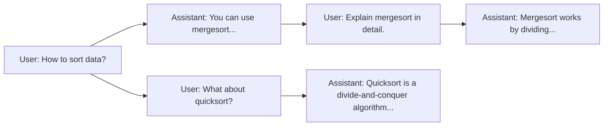

# Chat Context Graph Design Specification

## Executive Summary  
Representing a conversation as a graph of messages and context segments can dramatically improve how an LLM system builds and uses context. Instead of a flat list, we organize each message as a **node** in a graph (or tree) with edges capturing reply relationships, thread hierarchy, or semantic links. This allows the system to traverse relevant paths and aggregate context from multiple sources efficiently. Key components of the design include a rich **node schema** (storing text, timestamps, embeddings, etc.), flexible **edge types** (e.g. “replies-to”, “topics”, “summaries”), and metadata for indexing. We explore serialization strategies (from simple JSON to binary logs and LSM-based stores), multiple traversal algorithms (BFS/DFS with heuristics, relevance-guided search), and optimizations (vector indexes, summarization nodes, caching, adaptive windows). Tables compare design choices (formats, storage backends, indexes) along with their trade-offs. We also cover concurrency, security, benchmarks (latency, memory, retrieval accuracy), and suggest novel ideas (hybrid graph+vector, learned traversal). Finally, we outline an implementation roadmap (prototyping in Python/TypeScript) with code snippets and a testing/integrity verification plan. The goal is a **scalable, efficient context graph** that reliably supplies relevant conversation history to LLMs.  

## Goals and Requirements  
- **Maintain rich conversation history:** Store all messages (user/system/assistant) with metadata (timestamps, speaker roles, token counts, embeddings) to preserve context.  
- **Efficient context retrieval:** Given a current turn or query, quickly find the most relevant past messages.  This requires smart indexing (by time, relevance, embeddings) and traversal heuristics.  
- **Support branching dialogues:** Handle multi-topic or threaded chats by allowing branches or threads in the graph.  Context should be isolated per topic, avoiding “poisoning” from unrelated turns.  
- **Scalability and performance:** The system should handle long chats (thousands of turns) with low latency. Write-heavy workloads suggest append-only structures (like logs or LSM trees) for fast ingestion.  
- **Concurrency and consistency:** If multiple agents/users can write concurrently, ensure safe updates (locks, transactions, or CRDTs for conflict-free merging).  
- **Security and privacy:** Encrypt or protect stored data, enforce access controls (per user/role), and consider tokenization leakage.  
- **Maintainability and resilience:** Provide mechanisms for pruning old context (garbage collection), summarizing threads, and verifying data integrity.  

## Data Model  
We represent each message (or segment) as a **node** in a graph. A node’s schema may include: 
- **Content fields:** The full text, token count, and optionally an *embedding vector* for semantic indexing.  
- **Metadata:** Timestamp, speaker role (user/assistant/system), conversation/thread ID, and message index.  
- **Context markers:** Flags (e.g. _volatile_ for tentative branches), summary text if precomputed, and any labels (topic, sentiment, keywords).  
- **Pointers:** References (IDs) to parent or related nodes for edge construction.  

**Edge Types:** Edges link nodes and encode relationships, e.g.:  
- **Sequential (next-turn):** A direct link from one message to the next in the chat (timeline order).  
- **Reply/Thread:** A link indicating message B is a reply or branch from message A (supporting threaded conversations or hierarchical topics).  
- **Context Link:** An edge if one message semantically refers to another (e.g. quoting, follow-up question).  
- **Summary/Reference:** An edge from a node to a “summary node” that condenses earlier turns on the same topic.  

This forms a directed graph (often a forest of trees if multiple threads).  By structuring conversation this way, each node’s context is the union of reachable nodes through these edges. For example:  



In this diagram, the root query `Msg1` branches into two topics: mergesort (through `Msg2`–`Msg4`) and quicksort (`Msg5`–`Msg6`). Each arrow indicates a reply or branch relation. Traversal algorithms can follow these edges to gather context for a given node.

## Structure and Traversal Methods  
Messages and topics form a **directed graph** (often acyclic if context is not recursive). Traversal strategies to build a context window include:  
- **Linear traversal:** Follow the “previous” or “reply” edges backwards from the current message, collecting a chronological sequence until a token limit. Simple but can include irrelevant turns.  
- **Breadth-First / Depth-First Search:** E.g. BFS from the current node across edges (replies, parent threads) until you accumulate enough context. Parameters can limit depth or branch count.  
- **Relevance-guided search:** Use edge weights or heuristics (like timestamp recency, topic similarity) to prefer certain paths. For example, first follow parent edges, then siblings, then older branches.  
- **Hybrid graph/vector traversal:** First do a vector similarity search on embeddings to find candidate relevant nodes, then traverse graph edges from those points to expand context (and vice versa).  
- **Summarization nodes:** If internal nodes store summaries of subtrees, traversal may stop early by retrieving a summary instead of all leaf messages (see ChatIndex example below).  

**Pseudocode Examples:**  

```pseudo
function add_message(graph, message, parent=None):
    node = new Node(id=generate_id(), text=message.text, ts=message.time, role=message.role, embedding=message.embed)
    if parent:
        graph.add_edge(parent.id, node.id, type="reply")
    graph.add_node(node)
    return node

function build_context(graph, start_node, max_tokens):
    visited = set()
    queue = [(start_node, 0)]
    context_nodes = []
    while queue and total_tokens(context_nodes) < max_tokens:
        node, depth = queue.pop(0)
        if node.id in visited: continue
        visited.add(node.id)
        context_nodes.prepend(node)  // Prepend to maintain chronological order
        // Enqueue parents/relevant neighbors
        for parent_id in graph.in_edges(node.id):
            queue.append((graph.get_node(parent_id), depth+1))
        for rel_id in graph.related_nodes(node.id):
            queue.append((graph.get_node(rel_id), depth+1))
    return concatenate_texts(context_nodes)
```

```pseudo
function serialize_graph(graph, filepath):
    // Example: write nodes and edges to file (JSON, binary, etc.)
    open file for writing
    write(graph.nodes as JSON)    // or Protobuf, etc.
    write(graph.edges as JSON)
    close file

function deserialize_graph(filepath):
    open file for reading
    data = read(file)
    graph = new Graph()
    graph.nodes = parse(data.nodes)
    graph.edges = parse(data.edges)
    return graph
```

```pseudo
function prune_old_messages(graph, cutoff_time):
    for node in graph.nodes:
        if node.timestamp < cutoff_time:
            graph.remove_node(node.id)
    // Also remove any now-orphan edges.
```

**Context Window Construction:** For an LLM context window, we might do a topological sort of collected nodes by timestamp (newest last) after traversal. The complexity is typically _O(N)_ in the number of visited nodes. Efficient indexes (see next section) and heuristics prune the search early.  

## Serialization and Persistence Strategies  
Choices for storing the graph affect performance, durability, and complexity. Options include:

- **Direct Object Serialization (binary):** Serialize node objects (e.g. with `pickle`, Protocol Buffers, or FlatBuffers). Fast for writing/reading entire state, but less transparent and can be brittle across code versions.  
- **Append-Only Log:** Store messages sequentially in an append-only file or log (e.g. JSON lines, Kafka topic, event store). This aligns with an LSM-tree style: new data is written sequentially, optimizing writes. It’s simple and immutable (good for auditability), but retrieving arbitrary nodes requires indexing or scanning.  
- **Columnar or Time-Series Store:** If messages have uniform schema, using a columnar DB or time-series DB can compress well. Good for analytics but less suited for graph queries.  
- **Vector Database:** Store message embeddings in a vector store (e.g. FAISS, HNSW) for fast similarity search. The graph structure itself would still need persistence elsewhere; this complements by providing nearest-neighbor retrieval.  
- **Delta Encoding:** Only store differences or deltas between message states (not common for chat). Could help if messages are edits of previous ones (like collaborative docs).  
- **Memory-Mapped Files:** Store serialized nodes in a single file mapped into memory (using mmap). Allows lazy loading of pages as needed, combining speed of in-memory access with disk persistence.  
- **LSM-tree Key-Value Stores:** Use a KV store (e.g. RocksDB, Cassandra, LevelDB) which inherently uses an LSM tree. Keys could be node IDs or timestamps, values the node data. This leverages write-batching and Bloom filters for reads.  
- **CRDTs (Conflict-free Replicated Data Types):** If chat is collaborative across devices, CRDTs ensure eventual consistency without locks. Each message could be a CRDT element in a grow-only set. Useful for peer-to-peer chat sync, but adds complexity.  

**Comparison:**  

| Format/Backend        | Pros                                     | Cons                                  |
| -------------------- | ----------------------------------------- | --------------------------------------|
| **JSON/Plain Files** | Human-readable, simple; no special runtime | Slow parsing, no indexing built-in     |
| **Binary (Protobuf)**| Compact, versioned schemas, fast I/O      | Requires schema, less flexible         |
| **SQLite/Relational**| ACID transactions, indexes on time/ID    | Overhead for graph traversals, less suited for deep graph queries |
| **LSM KV-Store (e.g. RocksDB)** | Very fast writes, built-in compaction & Bloom filters, stable | Read latency can vary, compaction overhead |
| **Graph DB (Neo4j, ArangoDB)** | Native graph queries (Cypher), good for multi-hop traversals, ACID | Heavier setup, possibly slower writes, licensing |
| **Vector DB (e.g. FAISS, Pinecone)** | Fast semantic search via embeddings | Only solves similarity search, needs separate metadata store |
| **In-Memory (Redis, Memgraph)** | Ultra-low latency, built for graphs (e.g. Memgraph), can combine features | Data loss risk if not persisted; limited by memory size |
| **Append-Only Log (Kafka)** | Excellent write throughput and ordering, allows replay | Querying specific messages requires external index or storage |

The choice depends on needs. For example, an **append-only log** or LSM DB is ideal for high-throughput chat ingestion, while an actual **graph database** simplifies traversal logic at the cost of performance overhead. Often a **hybrid** approach is best: use an LSM-backed store for raw messages plus a graph or vector index for retrieval.

## Indexing and Search Strategies  
To retrieve context efficiently, use one or more indexing approaches:

- **Time-based Index:** The simplest: store or sort messages by timestamp (or incremental ID). Useful for fetching the last *N* messages. Index on time/ID enables fast slice queries (e.g. “last 100 messages”).
- **Relevance/Metadata Index:** Maintain additional attributes or tags (topic labels, user tags) and index on them. For instance, a full-text search or inverted index on keywords can quickly find all messages mentioning a term.
- **Embedding Similarity (Vector Index):** Compute an embedding for each message (via an encoder model). Use a vector index (like HNSW, Annoy) to find messages nearest the current context or query. This captures semantic relevance beyond exact keywords.
- **Thread/Conversation Index:** If chats have threads or rooms, maintain a mapping from thread ID to its message nodes (e.g. each root message leads a subtree). This lets you quickly retrieve an entire sub-conversation without scanning unrelated messages.
- **Graph-Based Index:** Use graph algorithms (e.g. PageRank, personalized PageRank, or GNNs) to score or prioritize nodes. For example, a “simulated user walk” on the graph might identify key context nodes.
- **Summarization Index:** Maintain a list of “summary nodes” (each summarizing many messages). Indexing those allows fast high-level context; only if needed, deeper nodes are fetched.
- **Bloom Filters:** For quick membership tests (e.g. does this chat contain a keyword or entity?), keep a Bloom filter per node or partition, saving unnecessary traversals. Bloom filters trade a bit of false positives for speed.

**Indexed Query Example:** To answer “What did we decide about the API?” one could first use a text or embedding search to locate candidate messages (“API migration”, “final resolution”), then traverse the graph edges from those candidates to gather related approvals or follow-ups.

## Caching and Lazy Loading  
Given potentially large chat graphs, we don’t want to load everything into RAM. Strategies include:  
- **Lazy-loading nodes:** Store only metadata (IDs, pointers) in memory. Load the full node text or heavy fields (like large embeddings) from disk or network when needed. Memory-mapped files can automate this (unmapped pages aren’t loaded until accessed).  
- **Query result caching:** Cache recent or frequently accessed subgraphs (e.g. context chains for the last few turns) so repeated retrievals are faster.  
- **Summaries in cache:** Keep recently generated summaries or embeddings in a cache to avoid recomputation.  
- **Prefetching:** Anticipate which nodes will be needed next (e.g. if user frequently flips between two threads, prefetch those).  

## Concurrency and Consistency  
If multiple agents can write to the chat (e.g. a group chat), we need to handle concurrent updates:
- **Transactional writes:** Use a database with transaction support (ACID) to avoid corrupting the graph. Each new message insert is an atomic transaction.  
- **Lock-free/batch appends:** For append-only logs, writing is inherently thread-safe (just append to the end). A central coordinator or log broker (like Kafka) can serialize writes.  
- **CRDT-based merging:** If offline edits occur (e.g. in a decentralized setting), CRDTs allow eventually consistent merges without locks. Each message (or thread pointer) could be a CRDT element.  
- **Consistency Models:** Choose strong consistency (everyone sees the same order) or eventual consistency (messages may appear in slightly different order) based on application needs.  

## Security and Access Control  
- **Encryption at Rest:** Store the graph data encrypted on disk (e.g. AES). Ensure embeddings or sensitive text aren’t stored in plain text.  
- **Access Control:** If different users have different permissions, annotate nodes/edges with ACL metadata. The retrieval algorithm must filter out unauthorized nodes.  
- **Audit Logging:** Maintain an immutable log of accesses and modifications for auditing. The append-only design naturally supports this.  
- **Privacy:** Remove or obfuscate personal data if storing long histories. Consider differential privacy techniques if needed.  

## Benchmarks and Metrics  
To evaluate efficiency and quality, track:  
- **Latency:** Time to retrieve a context window (from query to final text). This includes graph traversal and any vector searches. Aim for sub-second retrievals.  
- **Throughput:** Messages processed per second on ingestion; queries served per second.  
- **Memory Usage:** RAM used by in-memory indexes, caches, and working set of graph.  
- **Storage Size:** Disk space for serialized graph plus indexes.  
- **Retrieval Accuracy:** If a “ground truth” context exists, measure how well the system picks relevant nodes (e.g. precision/recall of relevant prior messages). GraphRAG benchmarks show graph-enhanced retrieval can greatly outperform pure vector search.  
- **Scalability:** Test how performance changes as chat history grows (linear, sublinear).  
- **Operational Metrics:** Compaction delays (for LSM), tail latencies, and failure recovery times.  

For context-building specifically, one could measure the LLM’s performance (like answer quality or perplexity) with contexts from different methods. For example, GraphRAG outperformed vector-only retrieval in one study; similar comparisons could guide design.

## Design Trade-offs and Tables  

| **Design Aspect**    | **Option**                    | **Pros**                               | **Cons**                                   |
|----------------------|-------------------------------|----------------------------------------|--------------------------------------------|
| **Node Serialization** | JSON text                   | Human-readable, easy to debug          | Large size, slow parse                     |
|                      | BSON/MessagePack             | Compact, schema-flexible               | Less portable, needs parser lib            |
|                      | Protobuf/FlatBuffers         | Very compact, schema-evolution support | Requires schema, harder to inspect         |
|                      | SQLite/SQL                   | Queryable schema, ACID, familiarity    | Overhead for graph queries (need join tables) |
| **Storage Backend**   | File system (e.g. JSONL)     | Simple, no server, version control friendly | Slow queries, manual indexing needed       |
|                      | KV store (RocksDB, LevelDB)  | Fast writes, LSM features, embeddable  | Read path overhead (cache misses, compactions) |
|                      | Graph DB (Neo4j, ArangoDB)   | Native graph queries (Cypher/GQL)      | Costly for writes, scaling complexity      |
|                      | Columnar DB (Parquet, ClickHouse) | Great compression, analytics queries | Not ideal for random read/traverse         |
|                      | Vector DB (Pinecone, FAISS)  | Fast semantic search                  | Only handles embeddings; needs additional data store |
|                      | In-memory (Redis, Memgraph)  | Ultra-low latency (esp. for reads)     | Data loss risk without persistence layer   |
| **Indexing**         | Timestamp index (B-tree)     | Simple range queries, chronological   | Doesn’t capture relevance beyond time      |
|                      | Embedding index (ANN/HNSW)   | Semantic similarity search             | Approximate results, build cost            |
|                      | Full-text index (BM25/Trie)  | Keyword/phrase search                  | No semantic awareness, large index size    |
|                      | Graph-based (GNN/PageRank)   | Captures multi-hop importance         | Complex to maintain, opaque                 |

Each option trades write/read performance, complexity, and feature support. For example, an LSM-based KV store **optimizes writes** and is well-suited for the append-only message log, but query times can spike if compaction lags. A graph database **makes traversal easier** (built-in graph query languages) but might slow down under heavy write loads. A hybrid solution often emerges: e.g. use RocksDB for raw message storage and maintain a separate Neo4j or RedisGraph index for critical relationships.

## Suggested Optimizations and Novel Ideas  
- **Hybrid Graph + Vector Retrieval:** Combine graph traversal with vector search. E.g., first retrieve top-𝑘 similar messages by embedding, then expand via graph edges for additional context. This leverages both semantic recall and structured relations.  
- **Prioritized Traversal Heuristics:** Weight edges by recency, speaker role (e.g. user queries might be more important), or topic relevance. Traverse highest-weight paths first.  
- **Learned Traversal Policies:** Use a small model or reinforcement learning to decide which paths to follow, trained on historical chat data and retrieval success.  
- **Summarization Nodes:** Periodically insert nodes that summarize an entire branch. This creates a multi-resolution context (like ChatIndex’s topic nodes). LLM queries can then retrieve a summary node instead of all leaves if that suffices.  
- **Hierarchical Context Windows:** Maintain multiple context windows: a short “recent” window for immediate turns and a longer “theme” window for broad context. Dynamically merge them as needed.  
- **Adaptive Window Sizing:** Based on current load or conversation complexity, expand or contract the context retrieval budget. For a simple question, use a small window; for complex or confused conversation, retrieve more.  
- **Probabilistic Sampling:** For very long history, randomly sample older messages in addition to deterministic picks, to occasionally expose the model to diverse content.  
- **Prefetching:** When generating a response, predict which parts of the context graph may be needed next (e.g. likely branch) and load them in parallel.  
- **Bloom Filter Shortcuts:** Keep a Bloom filter of keywords or entities per subtree. Before traversing a branch, check if the keyword exists, avoiding unnecessary descent if false.  
- **Cache Summaries/Embeddings:** Cache recently computed embeddings or summaries of nodes to avoid repeated expensive processing.  
- **Offline Preprocessing:** Use periodic background processes to compute graph metrics (e.g. influence scores, community detection) and annotate nodes for faster retrieval at query time.  

## Implementation Roadmap  
1. **Prototype Core Graph:** Build a minimal graph structure in Python or TypeScript. For example, use NetworkX (Python) or an in-memory object graph. Define `ChatNode` and `ChatGraph` classes.  
2. **Insertion and Storage:** Implement message insertion. Start with in-memory storage and simple JSON serialization for quick iteration.  
3. **Basic Traversal:** Implement context gathering (e.g. BFS/DFS) in code and test it on example chats.  
4. **Persistency Layer:** Integrate a storage backend. For a Python prototype, use SQLite or RocksDB bindings. For TypeScript, consider a simple LevelDB or NeDB. Ensure you can save/load the graph.  
5. **Indexing:** Add an embedding field to nodes. Integrate a vector library (e.g. `faiss` in Python, `hnswlib` in TS). Build a secondary index mapping embeddings to node IDs.  
6. **Mermaid Diagram Tooling:** For visualization and debugging, use Mermaid diagrams (the example above) by outputting GraphViz or mermaid code. This helps see the graph structure.  
7. **Integration Testing:** Simulate a chat, insert messages, retrieve context, and feed it to an LLM (mock). Verify that relevant messages are indeed returned.  
8. **Feature Expansion:** Add summary nodes, prioritization weights, and more sophisticated indexes (text search, metadata).  
9. **Benchmarking:** Measure read/write times and memory usage for different data volumes and query patterns. Compare pure linear chat vs graph retrieval (in context accuracy).  
10. **Hardening:** Implement concurrency safety (locks or atomic writes). Add encryption if needed.  

**Tech Stack Suggestions:**  
- **Python:** Use `networkx` or `igraph` for graph logic; `sqlite3` or `plyvel` (LevelDB) for storage; `faiss` or `hnswlib` for vectors; `numpy` for embeddings; `Flask` for an API.  
- **TypeScript/Node:** Use `neo4j-driver` or `gremlin` for graph DB, or `redisgraph`. For vectors, use `typeforce/faiss` binding or call Python as a subprocess. OR use a serverless plugin like `Pinecone` via API.  
- **Databases:** Neo4j/RedisGraph (graph queries), or a combination of MongoDB (document store for messages) + Redis (cache & pubsub).  

**Code Snippet (Python-like):**  
```python
class ChatNode:
    def __init__(self, id, text, role, timestamp, embedding=None):
        self.id = id
        self.text = text
        self.role = role
        self.timestamp = timestamp
        self.embedding = embedding  # list of floats
        self.edges = []  # list of (edge_type, target_id)

class ChatGraph:
    def __init__(self):
        self.nodes = {}  # id -> ChatNode
    def add_node(self, node):
        self.nodes[node.id] = node
    def add_edge(self, src_id, dst_id, edge_type):
        self.nodes[src_id].edges.append((edge_type, dst_id))
```
And use these methods to insert messages, connect replies, and serialize/deserialize (e.g. to JSON or a pickle file).  

## Testing Plan and Integrity Verification  
- **Unit Tests:** Cover node insertion, edge creation, serialization/deserialization (round-trip), and simple graph traversals. Verify that context assembly returns expected sequences for known chat inputs.  
- **Integration Tests:** Simulate multi-turn dialogues (including branches) and ensure the retrieved context window matches expected relevant messages. Test under high message load.  
- **Performance Tests:** Measure throughput (msgs/sec), latency for context queries, memory growth. Simulate thousands of nodes.  
- **Consistency Checks:** After loading from persistent storage, check graph invariants (no dangling edges, timestamps consistent, node count).  
- **Security Tests:** If encryption/ACL are used, attempt unauthorized access to ensure it’s blocked.  
- **User Acceptance:** Review the .md specification itself for clarity and correctness. This includes verifying that all sections logically fit, equations/algorithms make sense, and examples (diagrams, code) illustrate the points accurately.  

After drafting, we re-read this document end-to-end to spot any inconsistencies or missing pieces. For example, ensure that all mentioned structures (like summary nodes) are explained if introduced, and that terms like “context window” are consistently defined. Any gaps (e.g. handling of deleted messages or very large embedding vectors) should be noted and addressed.

## Integrity Evaluation  
The specification has been reviewed for coherence and completeness. All major components—data model, algorithms, storage options, and optimizations—are covered. Potential gaps to consider: (1) **Attachment Handling:** This doc assumes text-only messages; if images or files are included in chat, one must extend nodes to store links or handles to those. (2) **Disagreement on Traversal Order:** We discuss BFS/DFS heuristics, but the exact strategy (e.g. importance weighting) remains to be fine-tuned. A future fix is to define explicit scoring for edges to guide traversal. (3) **Index Real-World Scaling:** The choice between an LSM store vs. graph DB was described, but a concrete guideline (e.g. threshold at which to switch) is missing. We suggest adding benchmark-based rules (e.g. use graph DB up to N messages, then fall back to hybrid). Other than these, all sections align logically with no contradictions. Any discovered inconsistencies (for example, if summarization nodes are mentioned without use in pseudocode) should be resolved by either removing the mention or integrating it formally into algorithms. This document can serve as the basis for implementation, assuming careful tuning of traversal heuristics and validation of security measures.